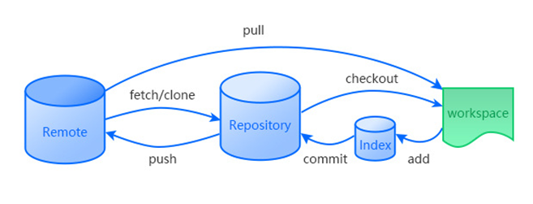

## 基本配置

```bash
git init  # 初始化
git config --global user.name "xxx"   # 配置用户名
git config --global user.email "xxx"  # 配置邮箱
git config --global core.ignorecase false  # 配置大小写敏感
git config --list  # 查看配置信息

```

### 创建ssh

```bash
ssh-keygen -t rsa -C "youremail@exaple.com" 
```

ssh文件默认路径`C:\Users\<User Name>\.ssh`

创建本机ssh之后可以在GitHub的settings里面添加,然后就可以连接GitHub仓库了

```bash
git remote add origin git@github.com:Bad-Oranges/LearnGit.git
git branch -M main  # 创建主分支
git push -u origin main  # Origin表示远程仓库，main表示本地仓库
```


## 基本操作

```bash
ll -ah  # 查看文件列表，包括隐藏文件夹
git status  # 查看本地文件状态
git log  # 查看提交日志
```

## 文件状态



```bash
```


## 分支与标签管理

```bash
git checkout –b dev /git switch -c dev  # 创建dev分支
git branch  # 查看分支
git commit –a –m “update file“  # 分支内容提交
git checkout master/git switch master  # 切换至master分支
git merge dev  # 合并分支
git branch –d dev  # 删除dev分支
```


### 分支策略

主分支仅用来发布新版本

dev分支负责开发工作

dev分支可以继续细分（按工作类型、人员）

### 标签管理

```bash
git tag v1.0 (Commit No.)  # 创建标签(对指定提交号添加标签，通过日志查找提交号)
git tag  # 查看标签
git tag -a v0.1 -m "version 0.1 released" 1094adb  # 创建带有描述信息的标签
git show <tagname>  # 查看标签说明文字
git tag –d v0.1  # 删除指定标签
git push origin v1.0  # 将标签push到远程仓库
git tag -d v0.9/git push origin :refs/tags/v0.9  # 删除远程标签需要先删除本地标签

```

